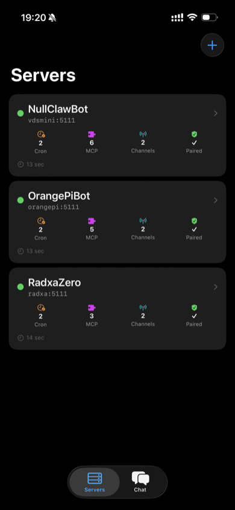
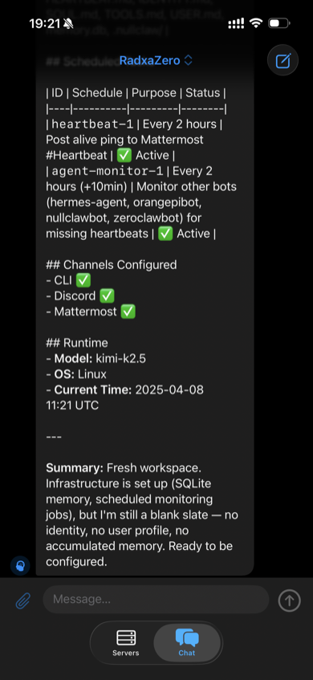
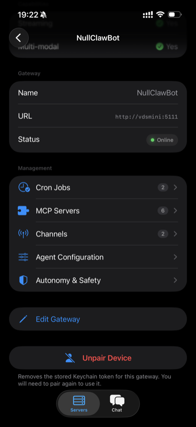
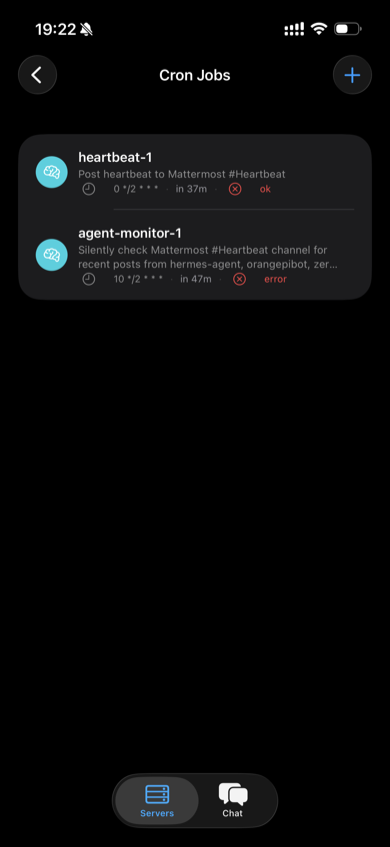
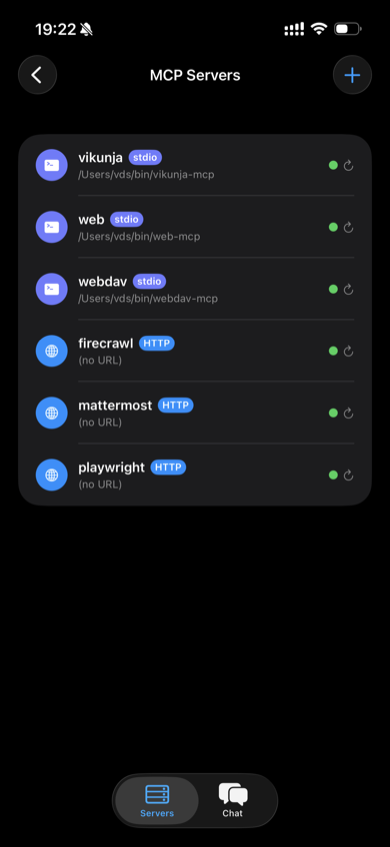

# NullClawUI

A native iOS client for [NullClaw](https://github.com/nullclaw) AI Gateways.

---

## Requirements

| | |
|---|---|
| iOS / iPadOS | 26.0+ |
| Xcode | 26+ |
| Swift | 6 (strict concurrency) |

---

## Screenshots

<table>
  <tr>
    <td align="center"><b>Servers Dashboard</b></td>
    <td align="center"><b>Chat</b></td>
  </tr>
  <tr>
    <td></td>
    <td></td>
  </tr>
  <tr>
    <td align="center"><b>Server Settings</b></td>
    <td align="center"><b>Cron Jobs</b></td>
  </tr>
  <tr>
    <td></td>
    <td></td>
  </tr>
  <tr>
    <td align="center"><b>MCP Servers</b></td>
    <td></td>
  </tr>
  <tr>
    <td></td>
    <td></td>
  </tr>
</table>

---

## Features

- **Multi-gateway chat** — connect to multiple NullClaw Gateways; switch instantly with the title-bar picker
- **Real-time streaming** — SSE-based streaming with exponential back-off reconnect
- **Conversation history** — searchable list of past conversations with expand/collapse; tap to resume
- **Secure pairing** — Bearer tokens stored in the system Keychain, keyed per gateway
- **Cron Jobs** — view, create, pause, resume, run, and delete scheduled jobs
- **MCP Servers** — view registered servers with live health status (auto-checked on load), add new servers
- **Channels** — view connection status of configured communication channels
- **Agent Configuration** — adjust model, temperature, system prompt, and limits
- **Autonomy & Safety** — set autonomy level and safety controls
- **Multi-modal input** — attach images and documents when the gateway supports it
- **Health monitoring** — per-gateway online/offline status with resource counts on the server card
- **Cost & Usage** — _hidden pending REST API endpoint_ (code preserved)

### Gateway REST API Dependencies

NullClawUI communicates with the gateway via two protocols:

1. **A2A protocol** (JSON-RPC over HTTP/SSE) for chat and task management
2. **Gateway REST API** (`/api/*`) for management features

Several REST endpoints used by this app **have not yet been merged into the NullClaw core**. Features that depend on unmerged endpoints may return errors or show placeholder data. Key endpoints in use:

| Endpoint | Purpose | Status |
|---|---|---|
| `GET /api/cron` | List cron jobs | Pending merge |
| `POST /api/cron` | Create cron job | Pending merge |
| `GET /api/mcp` | List MCP servers | Pending merge |
| `GET /api/mcp/:name` | MCP server status | Pending merge |
| `GET /api/channels` | List channels | Pending merge |
| `GET /api/capabilities` | Gateway capabilities | Pending merge |
| `GET /api/config/*` | Read/write config | Pending merge |
| `GET /api/doctor` | Health diagnostics | Pending merge |

Additional endpoints need to be implemented to enable features like adding/configuring channels directly from the app.

---

## Project Structure

```
NullClawUI/
├── App/              # @main entry, AppModel, DesignTokens, GatewayStore
├── Views/            # SwiftUI screens (ChatView, ServersView, etc.)
├── ViewModels/       # @Observable view models
├── Networking/       # GatewayClient (URLSession, SSE, JSON-RPC)
├── Security/         # KeychainService
├── Models/           # Codable types (AgentCard, ConversationRecord, REST API models)
└── Resources/        # Assets.xcassets, Info.plist
NullClawUITests/      # Unit tests
NullClawUIUITests/    # UI tests
```

---

## Getting Started

### Prerequisites

1. Xcode 26+
2. A running NullClaw Gateway instance (default: `http://localhost:5111`)
3. [xcodegen](https://github.com/yonaskolb/xcodegen) — run `brew install xcodegen`
4. [SwiftLint](https://github.com/realm/SwiftLint) — `brew install swiftlint`
5. [SwiftFormat](https://github.com/nicklockwood/SwiftFormat) — `brew install swiftformat`

### Build & Run

```bash
git clone <repo-url> && cd NullClawUI

# Regenerate the Xcode project (needed after any source file changes)
xcodegen generate

# Open in Xcode
open NullClawUI.xcodeproj
```

Set your development team in **Signing & Capabilities** before building.

### Run Tests

```bash
xcodebuild test \
  -scheme NullClawUI \
  -destination 'platform=iOS Simulator,name=iPhone 17'
```

### Lint & Format

```bash
swiftlint --strict
swiftformat --lint .
```

---

## Architecture

| Layer | Technology |
|---|---|
| State management | `@Observable` macro (Swift 6) |
| Navigation | `NavigationStack` with programmatic `NavigationPath` |
| Networking | `URLSession` + `async/await`; `AsyncSequence` for SSE |
| Persistence | SwiftData (`ConversationRecord`, `GatewayProfile`) |
| Credentials | System Keychain (`Security` framework) |
| Markdown | `AttributedString` (native) |
| Code generation | [xcodegen](https://github.com/yonaskolb/xcodegen) (`project.yml`) |

All UI mutations are `@MainActor`-isolated. No `DispatchQueue` usage.

---

## Security

Bearer tokens are stored exclusively in the **system Keychain**, keyed by the normalized gateway URL. No tokens are written to UserDefaults, disk files, or iCloud.

---

## Contributing

See [`CONTRIBUTING.md`](./CONTRIBUTING.md) for guidelines.

---

## License

MIT — see [`LICENSE`](./LICENSE).
